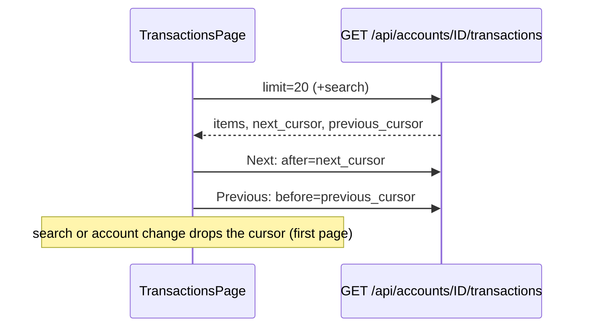

# feat/ui

## Flow: transactions paging

```mermaid
sequenceDiagram
  participant P as TransactionsPage
  participant A as GET /api/accounts/ID/transactions
  P->>A: limit=20 (+search)
  A-->>P: items, next_cursor, previous_cursor
  P->>A: Next: after=next_cursor
  P->>A: Previous: before=previous_cursor
  Note over P: search or account change drops the cursor (first page)
```
No total count or page numbers: the API returns none (a count is a full scan at scale).
