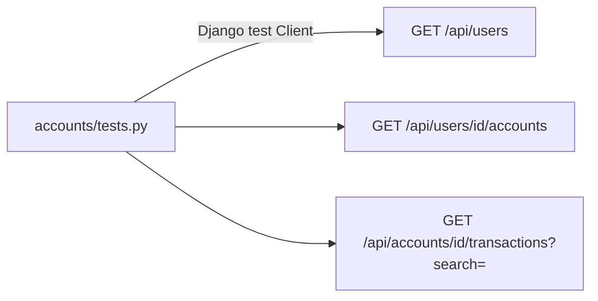

# test/backend-unit

Test-only change: no app code touched. Covers existing endpoints in `backend/accounts/api.py`.

```mermaid
flowchart LR
  T[accounts/tests.py] -->|Django test Client| U[GET /api/users]
  T --> A[GET /api/users/id/accounts]
  T --> X[GET /api/accounts/id/transactions?search=]
```
No entity, state or API changes.
- Review follow-up: tests-only tweaks.
